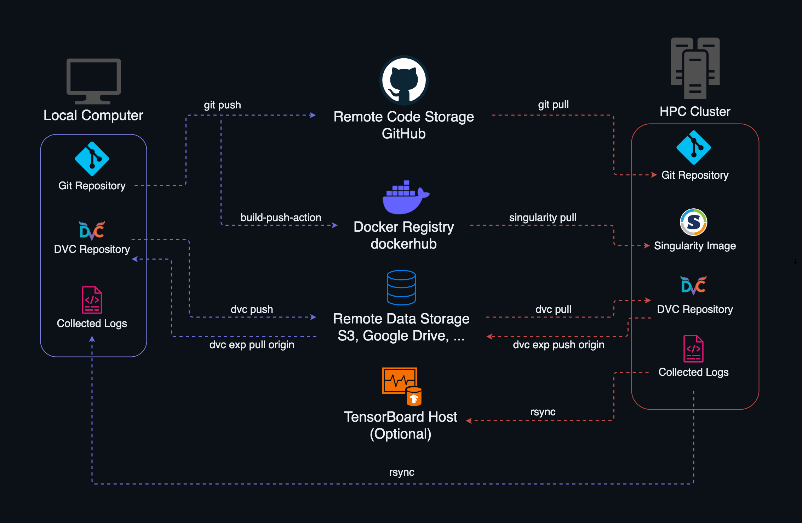

<!--
Copyright 2024 tu-studio
This file is licensed under the Apache License, Version 2.0.
See the LICENSE file in the root of this project for details.
-->

# Minimal working project for HPC-Cluster-ML-Workflow 
This template provides a minimal working project for the HPC-Cluster-Workflow including dummy data. After following just a few steps you should be ready to run the project locally. Then you can replace all stages of the pipeline with your own code.

## Changes to the orignal repo
- Replaced preprocess.py, train.py, model.py and export.py with a simple project that can be run immediately
- Added script that creates dummy input and target data
- Added dummy input and target data
- Defined parameters for runs of single python files in params.yaml (outputs get stored in debug_tmp/)
- Defined parameters for dvc runs with hydra in conf/config.yaml and subfolders

## Setup

This is taken mostly from the original setup instructions, but skips unnecessary steps for local runs and was adjusted were necessary.

**Table of Contents:**
- [1 - Initial Setup](#1---initial-setup)
- [2 - Docker Image](#2---docker-image)
- [3 - DVC Experiment Pipeline](#3---dvc-experiment-pipeline)
- [4 - Test and Debug Locally](#5---test-and-debug-locally)

### 1 - Initial Setup

This section will guide you through your initial project setup.

#### Create your Git Repository from the Template

- Navigate to the template repository on GitHub.
- Click **Use this template** &rarr; **Create a new repository**.
- Configure the repository settings as needed.
- Clone your new repository:
```sh
git clone git@github.com:<github_user>/<repository_name>.git
```
> **Note**: Replace `<github_user>` and `<repository_name>` with your actual GitHub username and repository name, or copy the URL of your repository from GitHub.
#### Change the Project Name

In your Git repository open the file [global.env](./../global.env) and modify the following variable (the others can be changed later):

`TUSTU_PROJECT_NAME`: Your Project Name

#### Set up a Virtual Environment

Go to your repository, create a virtual environment with the python version of your choice and install the required dependencies:

   ```sh
   cd <repository_name>
   python3.xx -m venv venv
   source venv/bin/activate
   pip install -r requirements.txt
   ```
   > **Note**: If you choose a different virtual environment name, update it in [.gitignore](./../.gitignore).

Save the python version of your virtual environment to the global environment file [global.env](./../global.env) (this is necessary for the Docker image build later):

> **Info**: Check your current version with `python --version`.

`TUSTU_PYTHON_VERSION`: The Python version for your project

#### Configure your DVC Remote

Choose a [supported storage type](https://dvc.org/doc/command-reference/remote/add#supported-storage-types) and install the required DVC plugin (e.g., for WebDAV):

##### WebDAV

**Quick configuration**: Uses existing [config](../.dvc/config) file and overwrites only required parts.

```sh
dvc remote add -d myremote webdavs://example.com/path/to/storage --force
dvc remote modify --local myremote user 'yourusername'
dvc remote modify --local myremote password 'yourpassword'
```

**Full configuration**: Reinitializes DVC repository and adds all configurations from scratch.

```sh
rm -rf .dvc/
dvc init 
dvc remote add -d myremote webdavs://example.com/path/to/storage
dvc remote modify --local myremote user 'yourusername'
dvc remote modify --local myremote password 'yourpassword'
dvc remote modify myremote timeout 600
dvc config cache.shared group
dvc config cache.type symlink
```

> **Info:** For detailed information regarding other storage types, refer to the [DVC documentation](https://dvc.org/doc/command-reference/remote).

#### Configure Docker Registry  

- **Sign Up for Docker Hub:** If you do not have an account, register at [Docker Hub](https://app.docker.com/signup?).
- **Configure GitHub Secrets:** In your GitHub repository, go to **Settings** → **Security** → **Secrets and variables** → **Actions** → **New repository secret**, and add secrets for:
   - `DOCKER_USERNAME`: Your Docker Hub username
   - `DOCKER_PASSWORD`: Your Docker Hub password
- **Update Global Environment File:** Edit [global.env](./../global.env)  to set:
   - `TUSTU_DOCKERHUB_USERNAME`: Your Docker Hub username

### 2 - Create a Docker Image

#### Build the Docker Image

To debug your Docker image locally, install Docker for your operating system / distro. For Windows and macOS, you can install [Docker Desktop](https://www.docker.com/products/docker-desktop/).

To build your Docker image, use the following command in your project directory. Substitute the placeholder `<your_image_name>` with a name for your image: 

```sh
docker build -t <your_image_name> .
```

> **Info**: The [Dockerfile](../Dockerfile) provided in the template will install the specified Python version (see [Set Up a Virtual Environment](#set-up-a-virtual-environment)) and all dependencies from the requirements.txt file on a minimal Debian image.

#### Test the Docker Image

Run the Docker image locally in an interactive shell to test that everything works as expected:

```sh
docker run -it --rm <your_image_name> /bin/bash
```

#### Automated Image Builds with GitHub Actions

After testing your initial Docker image locally, use the GitHub Actions workflow for automatic builds: 
- Make sure your dependency versions are fixed in requirements.txt.
- Push your changes to GitHub and the provided workflow [docker_image.yml](../.github/workflows/docker_image.yml) builds the Docker image and pushes it to your configured Docker registry.
- It is triggered whenever the [Dockerfile](../Dockerfile), the [requirements.txt](../requirements.txt) or the workflow itself is modified.
> **Note**: For the free `docker/build-push-action`, there is a 14GB storage limit for free public repositories on GitHub runners ([About GitHub runners](https://docs.github.com/en/actions/using-github-hosted-runners/about-github-hosted-runners/about-github-hosted-runners)). Therefore, the Docker image must not exceed this size.

> **Info:** At the moment the images are only built on ubuntu-latest runners for the x86_64 architecture. Modify [docker_image.yml](../.github/workflows/docker_image.yml) if other architectures are required.

### 3 - DVC Experiment Pipeline

This section guides you through setting up the DVC experiment pipeline. The DVC experiment pipeline allows you to manage and version your machine learning workflows, making it easier to track, reproduce, and share your experiments. It also optimizes computational and storage costs by using an internal cache storage to avoid redundant computation of pipeline stages.

> **Info:** For a deeper understanding of DVC, refer to the [DVC Documentation](https://dvc.org/doc).

#### Add Dataset to the DVC Repository / Remote

Add data to your experiment pipeline (e.g., raw data) and push it to your DVC remote:

```sh
dvc add data/raw
# follow the instructions and add the .dvc file to git
git add data/raw.dvc
dvc push
```
### 4 - Test and Debug Locally

We recommend that you test and debug your DVC experiment pipeline locally before running it on the HPC cluster. This process will help you identify and resolve any problems that may occur during pipeline execution.

#### Run the DVC Experiment Pipeline Natively

Execute the following command to run the pipeline:

```sh
./exp_workflow.sh
```

This shell script runs the experiment pipeline (`dvc exp run`) and performs some extra steps such as importing the global environment variables and duplicating the repository into a temporary directory to avoid conflicts with the DVC cache when running multiple experiments simultaneously.

#### Run the DVC Experiment Pipeline in a Docker Container

In order to run the DVC experiment pipeline in a Docker container we need to first setup a docker volume containing our local ssh setup. Since the local ssh setup is not visible to the docker container, we will then mount the volume to the container. A simple bind mount will allways work, because the .ssh folder ownership is not changed.

To create the Docker volume, use the following command:

```sh
docker volume create --name ssh-config
```

In order to copy the local ssh setup to the Docker volume, we are obliged to create a temporary container that binds the volume.

```sh
docker run -it --rm -v ssh-config:/root/.ssh -v $HOME/.ssh:/local-ssh alpine:latest
# Inside the container
cp -r /local-ssh/* /root/.ssh/
# Copying the files will change the ownership to root
# Check your the files
ls -la /root/.ssh/

# Optional - in case you have a config file in your dotfiles something similar to this might be needed as well
docker run -it --rm -v ssh-config:/root/.dotfiles/ssh/.ssh -v $HOME/.ssh:/local-ssh alpine:latest
# Inside the container
cp -r /local-ssh/* /root/.ssh/
```

> **Info**: This will not change the ownership of the files on your local machine.

Next as dvc needs the git username and email to be set, we will create a `local.env` file in the repository root directory with the following content:

```env
TUSTU_GIT_USERNAME="Your Name"
TUSTU_GIT_EMAIL="name@domain.com"
```

> **Info**: This file is git-ignored and is read by the [exp_workflow.sh](./../exp_workflow.sh) script. It will then configure git with the provided username and email every time the script is run. Your local git configuration will not be changed, as this happens only if the [exp_workflow.sh](./../exp_workflow.sh) script is run from within a Docker container.

We can now run the experiment within the docker container with repository and SSH volume mounted:

```sh
docker run --rm \
  --mount type=bind,source="$(pwd)",target=/home/app \
  --mount type=volume,source=ssh-config,target=/root/.ssh \
  <your_image_name> \
  /home/app/exp_workflow.sh
```

In case you want to interact with the container, you can run it in interactive mode. `docker run --help` shows you all available options.

```sh
docker run -it --rm \
  --mount type=bind,source="$(pwd)",target=/home/app \
  --mount type=volume,source=ssh-config,target=/root/.ssh \
  <your_image_name>
```
## Usage

### Python scripts

Update source/preprocess.py with your own dataloading and preprocessing.
Update source/model.py with your own models.
Update source/train.py with your training loop.
Update source/export.py to export your model.

### DVC stages

Manually add your stages to the [dvc.yaml](../dvc.yaml) file:
- `cmd:` Specify the command to run the stage.
- `deps:` Decide which dependencies should launch the stage execution on a change.
- `params:` Include the hyperparameters from [params.yaml](../params.yaml) that should launch the stage execution on a change.
- `out:` Add output directories.
- The last stage should be left as `save_logs`, which will copy the logs to the DVC experiment branch before the experiment ends and is pushed to the remote.
> **Note**: The stage scripts should be able to recreate the output directories, as DVC deletes them at the beginning of each stage.

### Parameters

Parameters for dvc experiments should be defined in conf/config.yaml and subfolders to be tracked by dvc.

Parameters for debugging single python files should be defined in params.yaml.

Parameters for both dvc experiments and single python file runs can be accessed like this:

```
cfg = OmegaConf.load("params.yaml")
param = cfg.subfolder.param
```


# Original description of the HPC-Cluster-ML-Workflow 
 This template provides structured workflow tailored for audio machine learning research on the [HPC Cluster of ZECM at TU Berlin](https://www.tu.berlin/campusmanagement/angebot/high-performance-computing-hpc). It was developed for projects that require continuous management of multiple experiments to ensure high reproducibility and reliability of results. By incorporating tools such as DVC, Docker, and TensorBoard, the template not only enhances reproducibility but also provides a robust framework for effective collaboration and seamless sharing of experiments.

## Features
- **Reproducible Experiments**:
  - Tracks all dependencies, configurations, and artifacts to ensure experiments can be easily reproduced and shared.
  - Uses containerization to maintain consistency across different systems.
- **Resource Optimization**:
  - Reuses unchanged stages to avoid redundant computations, speeding up workflows and conserving resources.
- **Automation**:
  - Reduces manual tasks through automated builds, data pipelines, and syncing, allowing you to focus on research.
- **HPC Integration**:
  - Extends DVC for multi-node parallel experiments, optimizing HPC resource utilization.
  - Supports Docker for development, with automated conversion to Singularity for seamless HPC deployment.
- **TensorBoard Integration**:
  - Provides visualization and comparison of DVC experiments with audio logging support of TensorBoard.
  - Enables real-time monitoring and quick decisions on underperforming runs.
  
## Overview
The table below summarizes the key tools involved in the HPC-Cluster-ML-Workflow, detailing their primary roles and providing links to their official documentation for further reference.

<table align="center" style="width: 60%; border-collapse: collapse;">
  <tr>
    <th>Tool</th>
    <th>Role</th>
    <th>Documentation</th>
  </tr>
  <tr>
    <td><b>Git</b></td>
    <td>Version control for code.</td>
    <td><a href="https://git-scm.com/doc">Git Docs</a></td>
  </tr>
  <tr>
    <td><b>DVC</b></td>
    <td>Data version control and pipeline management.</td>
    <td><a href="https://dvc.org/doc">DVC Docs</a></td>
  </tr>
  <tr>
    <td><b>TensorBoard</b></td>
    <td>DVC experiment visualization and monitoring.</td>
    <td><a href="https://www.tensorflow.org/tensorboard">TensorBoard Docs</a></td>
  </tr>
  <tr>
    <td><b>Docker</b></td>
    <td>Containerization for development, converted to Singularity for HPC.</td>
    <td><a href="https://docs.docker.com">Docker Docs</a></td>
  </tr>
  <tr>
    <td><b>Singularity</b></td>
    <td>HPC-compatible containerization tool.</td>
    <td><a href="https://docs.sylabs.io">Singularity Docs</a></td>
  </tr>
  <tr>
    <td><b>SLURM</b></td>
    <td>Job scheduling and workload management on the HPC-Cluster.</td>
    <td><a href="https://slurm.schedmd.com/documentation.html">SLURM Docs</a></td>
  </tr>
</table>

### System Transfer
The figure below offers a simplified overview of how data is transferred between systems. While some of the commands depicted are automated by the provided workflows, the visualization is intended for comprehension and not as a direct usage reference.
        <p align="center">
        
        </p>

## Prerequisites
- macOS, Windows or Linux operating system.
- Access to an HPC Cluster with SLURM-sheduler.
- Local Python installation.
- Familiarity with Git, DVC, and Docker.
- Docker Hub account.

## Setup 
Follow the setup instructions below for step-by-step guidance on configuring this template repository, which offers a basic PyTorch project that you can customize, reuse, or reference for your pipeline implementation.

- [Setup Instructions](docs/SETUP.md)

## Usage
Once the setup is complete, you can begin using the setup by referring to the User Guide provided. This guide will help you to understand how to develop, initiate experiments and monitor your training processes.

- [User Guide](docs/USAGE.md)

## Contributors
- [Michael Witte](https://github.com/michaelwitte)
- [Fares Schulz](https://github.com/faressc)
- [Maxime Hubert](https://github.com/jaimecomprendre)

## License
This project is licensed under the Apache License, Version 2.0. See the [LICENSE](LICENSE). 

## References
**Schulz, F. [faressc]. (n.d.). *Guitar LSTM* [pytorch-version]. GitHub. [Link](https://github.com/faressc/GuitarLSTM/tree/main/pytorch-version)**
